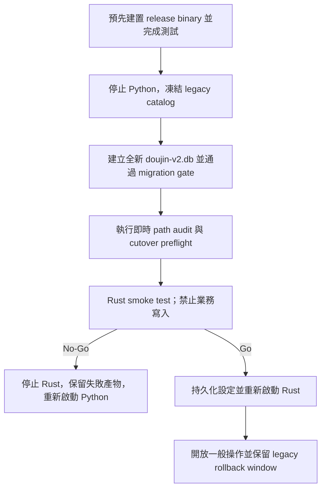

# Rust v2 正式切換與 rollback runbook

## 目的與邊界

本 runbook 將既有 Python catalog 切換到新的 Rust v2 catalog。它遵守 DEC-037：不覆寫、不重新命名，也不原地升級 `L:\doujin-tagger\doujin.db`。Rust server 只接收新建的 `doujin-v2.db`；rollback 透過停止 Rust、重新啟動仍保留的 Python catalog 完成，不做反向 schema 轉換。

執行正式切換前必須取得收藏管理者當次明確授權。批次 20 只驗證這份流程，沒有執行正式切換。



## 不可違反的安全條件

1. Legacy catalog、candidate catalog、migration reports 必須是不同路徑；Rust server 絕不能收到 `doujin.db`。
2. Migration output directory 必須事先不存在；所有產物以 create-new 語意建立。
3. Python 與 Rust 不得同時監聽正式 port，也不得同時寫入兩個 catalog。
4. `doujin.db`、其既有備份與通過 gate 的 migration artifacts，在收藏管理者明確關閉 rollback window 前都不得刪除。
5. Smoke test 階段禁止 scan、metadata／tag 修改、外部搜尋、檔案開啟、搬移與刪除。
6. 任一 gate 失敗即 No-Go；不得只略過失敗 check 繼續啟動。
7. 正式 server 目前以前景程序執行，以 `Ctrl+C` 走 graceful shutdown。服務化、自動登入啟動或排程工作屬另一批次，不在本 runbook 內臨時加入。

## Phase 0：切換前準備，不需停機

在 PowerShell 設定固定路徑並完成 release build：

```powershell
Set-Location 'L:\doujin-tagger-rust'

$projectRoot = 'L:\doujin-tagger-rust'
$legacyProjectRoot = 'L:\doujin-tagger'
$legacyCatalog = Join-Path $legacyProjectRoot 'doujin.db'
$httpBinary = Join-Path $projectRoot 'target\release\doujin-http.exe'
$auditBinary = Join-Path $projectRoot 'target\release\doujin-path-audit.exe'
$port = 5000

cargo test --workspace
cargo clippy --workspace --all-targets -- -D warnings
cargo build --locked --release `
  -p doujin-http -p doujin-migrate

Get-FileHash -Algorithm SHA256 -LiteralPath $httpBinary
Get-FileHash -Algorithm SHA256 -LiteralPath $auditBinary
```

任一指令失敗就停止。保存 Rust／Cargo 版本、binary SHA-256 與測試輸出到當次切換紀錄。

## Phase 1：凍結 Python catalog

1. 通知使用者進入維護時間，不再於舊 UI 執行 scan、metadata 或檔案操作。
2. 在舊 Python server 的前景視窗按 `Ctrl+C`，等待程序正常返回 prompt。
3. 以唯讀查詢確認沒有遺留程序或正式 port listener：

```powershell
Get-CimInstance Win32_Process | Where-Object {
  $_.Name -match '^pythonw?\.exe$' -and
  $_.CommandLine -match [regex]::Escape($legacyProjectRoot) -and
  $_.CommandLine -match 'app\.py'
} | Select-Object ProcessId, Name, CommandLine

Get-NetTCPConnection -LocalPort $port -State Listen -ErrorAction SilentlyContinue

@("$legacyCatalog-wal", "$legacyCatalog-shm", "$legacyCatalog-journal") |
  Where-Object { Test-Path -LiteralPath $_ }

Get-FileHash -Algorithm SHA256 -LiteralPath $legacyCatalog
```

以上應分別得到：沒有 Python process、沒有 listener、沒有 sidecar，以及一筆記錄下來的 legacy SHA-256。若無法正常停止，只能在核對確切 PID 與 command line 後處理；不得用模糊程序名稱批次終止。

## Phase 2：建立最終 v2 candidate

為每次嘗試建立新的、不可覆寫的輸出目錄：

```powershell
$cutoverRoot = Join-Path $projectRoot 'cutover'
if (-not (Test-Path -LiteralPath $cutoverRoot)) {
  New-Item -ItemType Directory -Path $cutoverRoot | Out-Null
}
$cutoverId = Get-Date -Format 'yyyyMMdd-HHmmss'
$cutoverDir = Join-Path $cutoverRoot $cutoverId

if (Test-Path -LiteralPath $cutoverDir) {
  throw "cutover output 已存在：$cutoverDir"
}

& .\tools\run_migration_rehearsal.ps1 `
  -SourceCatalog $legacyCatalog `
  -OutputDirectory $cutoverDir `
  -CargoManifest .\Cargo.toml `
  -TargetFileName 'doujin-v2.db'

if ($LASTEXITCODE -ne 0) { throw 'Migration gate 未通過' }

$candidate = Join-Path $cutoverDir 'doujin-v2.db'
$migrationReport = Join-Path $cutoverDir 'migration-report.json'
$acceptanceGate = Join-Path $cutoverDir 'acceptance-gate.json'
$pathAuditReport = Join-Path $cutoverDir 'path-audit-report.json'

& $auditBinary $candidate $pathAuditReport
if ($LASTEXITCODE -ne 0) { throw 'Path audit 未通過' }
```

每次失敗嘗試都保留自己的 reports 供診斷；修正後使用新的 `$cutoverId`，不得覆寫舊目錄或只替換其中一個檔案。

## Phase 3：只讀 cutover preflight

```powershell
$readinessReport = Join-Path $cutoverDir 'cutover-readiness.json'

& .\tools\test_cutover_readiness.ps1 `
  -LegacyCatalog $legacyCatalog `
  -CandidateCatalog $candidate `
  -MigrationReport $migrationReport `
  -AcceptanceGate $acceptanceGate `
  -PathAuditReport $pathAuditReport `
  -HttpBinary $httpBinary `
  -PathAuditBinary $auditBinary `
  -Port $port |
  Tee-Object -FilePath $readinessReport

if ($LASTEXITCODE -ne 0) { throw 'Cutover preflight blocked' }
$readiness = Get-Content -LiteralPath $readinessReport -Raw | ConvertFrom-Json
if ($readiness.status -ne 'ready') { throw 'Cutover 尚未 ready' }
```

Preflight 會重新計算兩個 catalog SHA-256、拒絕 sidecars、核對所有 migration gate 與 report 路徑、即時重跑 current path audit、驗證設定、確認 Python／Rust 已停止且 port 未被占用。它不啟動 server、不建立 sidecar，也不修改 catalog。

## Phase 4：Rust smoke test，暫不開放寫入

建立只保存 cache 目錄的 Rust config：

```powershell
$configPath = Join-Path $cutoverDir 'rust-config.json'
@{ thumb_dir = 'thumbnails' } |
  ConvertTo-Json |
  Set-Content -LiteralPath $configPath -Encoding utf8NoBOM
```

在「Server」PowerShell 視窗以前景方式啟動；第一次使用環境 override 套用 legacy 設定，但尚不持久化：

```powershell
$env:DOUJIN_CONFIG_PATH = $configPath
$env:DOUJIN_READER_PATH = 'C:\Program Files\Honeyview\Honeyview.exe'
$env:DOUJIN_THUMB_SIZE = '480x640'
$env:DOUJIN_THUMB_QUALITY = '100'

& $httpBinary $candidate $port
```

在另一個「驗收」視窗執行唯讀 smoke checks：

```powershell
$base = "http://127.0.0.1:$port"
$headers = @{ Host = "localhost:$port" }

Invoke-RestMethod -Uri "$base/api/health" -Headers $headers
Invoke-RestMethod -Uri "$base/api/settings" -Headers $headers
Invoke-RestMethod -Uri "$base/api/stats" -Headers $headers
Invoke-RestMethod -Uri "$base/api/collections?q=MARIAGE%20PINK&per_page=10" -Headers $headers
Invoke-WebRequest -Uri "$base/api/collections/13601/thumbnail" -Headers $headers -UseBasicParsing
Invoke-WebRequest -Uri "$base/api/collections/11768/thumbnail" -Headers $headers -UseBasicParsing
```

再用瀏覽器開啟 `http://localhost:5000/`，抽查藏書、搜尋、詳細資料、統計、工作台與設定頁。期望值至少包含：

- Health `status=ok`。
- 13,566 筆有效收藏；同人誌 12,104、CG 1,126、商業誌 336，或與最終 migration report 對應的新數量。
- Settings 顯示 `480x640`、品質 100、Honeyview，且三項標為 environment overrides。
- ZIP 與圖片資料夾 thumbnail 最終皆為 HTTP 200、`image/webp`、非空內容。
- Browser console 與 server stderr 沒有未解錯誤。
- 非 localhost Host 被拒絕。

任何結果不符時，Server 視窗按 `Ctrl+C`，走「尚未開放業務寫入」rollback；不要在失敗的 candidate 上嘗試 scan 或人工修資料。

## Phase 5：Go 決策與正式啟動

只有收藏管理者明確回答 Go 後，才透過同一 localhost API 持久化設定：

```powershell
$settingsBody = @{
  viewer_path = 'C:\Program Files\Honeyview\Honeyview.exe'
  thumb_size = '480x640'
  thumb_quality = 100
} | ConvertTo-Json

Invoke-RestMethod -Method Put `
  -Uri "$base/api/settings" `
  -Headers $headers `
  -ContentType 'application/json' `
  -Body $settingsBody
```

在 Server 視窗按 `Ctrl+C` 正常停止，清除三個一次性 override，再只保留 config path 重新啟動：

```powershell
Remove-Item Env:DOUJIN_READER_PATH -ErrorAction SilentlyContinue
Remove-Item Env:DOUJIN_THUMB_SIZE -ErrorAction SilentlyContinue
Remove-Item Env:DOUJIN_THUMB_QUALITY -ErrorAction SilentlyContinue
$env:DOUJIN_CONFIG_PATH = $configPath

& $httpBinary $candidate $port
```

重新確認 `/api/settings` 的值相同且 `environment_overrides` 為空。此時 `http://localhost:5000/` 才成為正式入口，並可解除維護狀態。

記錄 Go 時間、legacy／candidate 初始 SHA-256、release binary SHA-256、reports 目錄及負責人。保留 `doujin.db` 與整個 `$cutoverDir`；不要把 cache、WAL 或正在執行中的 candidate 當成可直接複製的靜態備份。

## Rollback A：尚未開放業務寫入

適用於 preflight 或 smoke test 失敗，以及 Go 前只產生 thumbnail／settings 等可重建內容的情況。

1. Server 視窗按 `Ctrl+C`，確認 Rust 程序與 port listener 消失。
2. 保留整個失敗 `$cutoverDir` 與 logs，不刪除、不覆寫。
3. 確認 `doujin.db` SHA-256 與 migration gate 記錄一致，且沒有 sidecar。
4. 以前景方式重新啟動原 Python `app.py`，確認 health／首頁與既有收藏數。
5. 記錄 No-Go 原因。下一次修正後建立新的 cutover directory。

這條路徑不需要反向 migration，因為 legacy catalog 從未被 Rust 開啟。

## Rollback B：Go 後已有業務寫入

先停止 Rust 並封存 candidate；不要直接啟動 Python。依影響分流：

- 只有 metadata、tags、人工裁決或外部搜尋：舊 Python 可以啟動，但這些 v2-only 變更會消失。必須先由收藏管理者明確接受資料損失，或另行實作／執行匯出與人工合併。
- 已執行 scan：確認是否新增、tombstone 或重新命名收藏，再決定舊 catalog 是否仍能代表檔案系統。
- 已執行 move、軟刪除或永久刪除：舊 catalog 的 filepath 可能失效，永久刪除也可能無法回復。必須先依 `file_operations`、實際檔案與資源回收桶逐筆裁決；在路徑一致前不得啟動舊 UI 進行新的寫入。

Rollback window 沒有預設自動到期。只有收藏管理者明確確認不再需要回復，而且另有已驗證備份後，才可另批處理 legacy catalog 的封存或刪除。

## Go／No-Go 摘要

Go 必須同時符合：release build 與測試通過、Python 已停止、final migration gate 通過、fresh path audit 通過、preflight `ready`、smoke checks 通過、正式設定持久化後可無 override 重啟。

任一項不成立即 No-Go。禁止以「之後再補報告」「只是少數路徑」「先開放再觀察」取代 gate。
